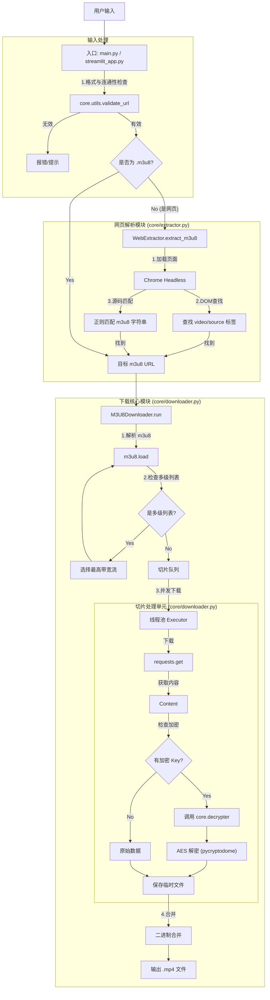
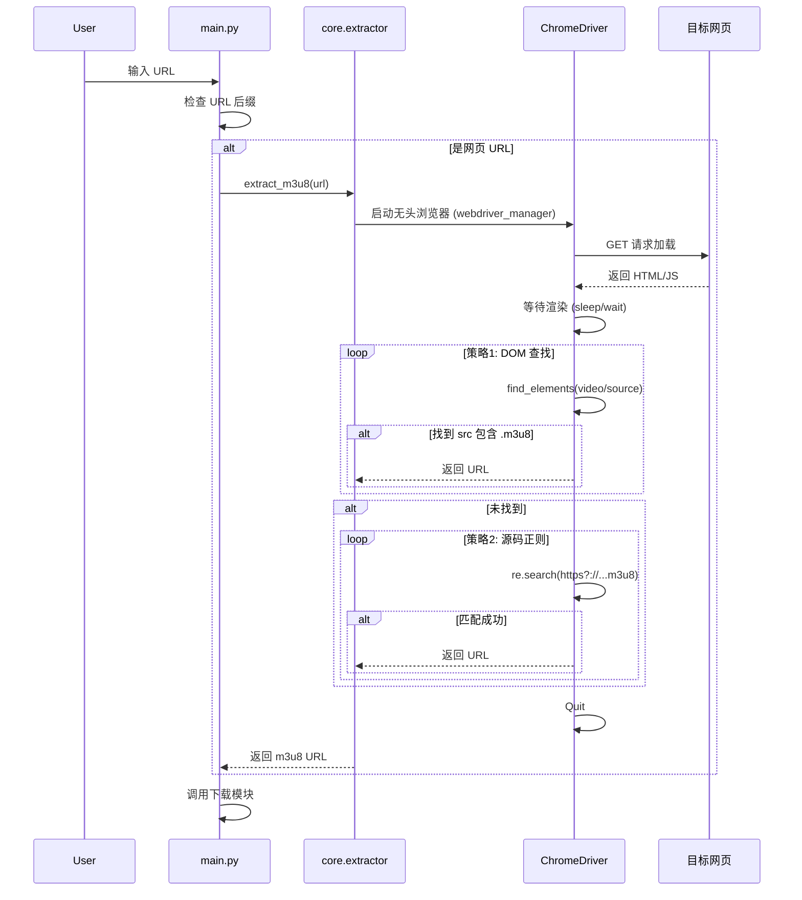

# 智能 m3u8 视频下载器技术文档

## 1. 项目简介

本项目实现了一个智能化的视频下载工具，旨在解决复杂场景下的 HLS (m3u8) 视频下载问题。它不仅支持直接的 m3u8 链接下载，还能自动解析网页中的视频地址，并具备处理加密流、伪装后缀、多级播放列表等高级功能。

项目采用模块化设计，支持 CLI（命令行）和 GUI（图形界面）双模式运行，适配 macOS 及 Linux 环境。

## 2. 核心功能

1.  **智能输入识别与检测**:
    - 自动区分用户输入的是 m3u8 地址还是网页地址。
    - **预检测机制**: 在启动任务前自动验证 URL 的格式和连通性（支持自动处理 SSL 错误、超时重试和反爬放行）。
2.  **网页自动解析**:
    - 使用 Selenium 模拟浏览器环境。
    - **智能标题提取**: 自动提取网页标题或 H1 标签作为视频文件名。
    - **深度 URL 清洗**: 自动处理嵌套在播放器参数中的真实 m3u8 地址。
3.  **复杂流处理**:
    - 支持 AES-128 加密流的自动解密（内存中进行，无中间明文落地）。
    - 支持非标准后缀（如 .jpg, .png）的切片下载。
    - 支持多级 m3u8 播放列表（自动选择最高画质）。
4.  **稳健下载**:
    - 多线程并发下载切片。
    - 自动重试与错误处理。
    - **智能命名**: 优先使用网页标题，无标题时自动使用时间戳+序号生成唯一文件名，防止覆盖。
5.  **双模式运行**:
    - **CLI**: 纯命令行模式，适合脚本调用。
    - **GUI**: 基于 Streamlit 的图形界面，操作更直观。

## 3. 项目结构

```text
smart-downloader/
├── main.py                # CLI 统一入口文件
├── streamlit_app.py       # GUI 入口文件
├── core/                  # 核心逻辑包
│   ├── downloader.py      # m3u8 下载与合并逻辑 (M3U8Downloader 类)
│   ├── extractor.py       # 网页解析逻辑 (WebExtractor 类)
│   ├── decrypter.py       # 解密逻辑 (Decrypter 类)
│   └── utils.py           # 通用工具 (路径处理、文件清理)
├── specs/                 # 需求与设计文档
│   ├── m3u8_downloader/   # 下载核心模块设计文档
│   └── web_m3u8_downloader/# 网页解析模块设计文档
└── README.md              # 项目文档
```

## 4. 架构设计

### 4.1 模块交互图



### 4.2 详细处理流程

#### A. 网页解析流程



## 5. 关键技术点

1.  **WebDriver 自动管理**: 使用 `webdriver_manager` 库，在运行时动态下载与本地 Chrome 版本匹配的 ChromeDriver，彻底解决了版本不一致导致的 `SessionNotCreatedException` 错误。
2.  **鲁棒的 URL 拼接**: 使用 `urllib.parse.urljoin` 处理 m3u8 中的相对路径，确保无论是 `/` 开头的绝对路径还是相对当前目录的路径都能正确转换。
3.  **对抗混淆**:
    - 不依赖文件后缀判断文件类型，直接处理二进制流，有效应对将 `.ts` 伪装成 `.jpg` 的反爬策略。
    - 模拟真实浏览器 User-Agent，防止服务器拒绝请求。
4.  **内存解密**: 即使视频流被加密，解密过程也在内存中完成，写入磁盘的直接是解密后的视频数据，方便后续合并和播放。

## 6. 环境与依赖

### 6.1 运行环境
- **Operating System**: macOS / Linux / Windows
- **Python**: 3.8+
- **Browser**: Google Chrome (用于 Selenium 网页解析)

### 6.2 Python 依赖
- `selenium`: 网页自动化
- `webdriver-manager`: 驱动管理
- `m3u8`: 播放列表解析
- `requests`: HTTP 请求
- `pycryptodome`: AES 解密
- `streamlit`: Web GUI 界面

安装命令:
```bash
pip install -r requirements.txt
```

## 7. 部署与运行

### 7.1 本地运行

#### 方式一：图形界面 (GUI) - **推荐**

无需记忆复杂命令，直接在浏览器中操作。

```bash
streamlit run streamlit_app.py
```

- **特点**:
  - 支持实时进度条显示。
  - 自动识别网页标题。
  - 友好的错误提示与排查建议。
  - 自动识别用户主目录，安全保存文件。

#### 方式二：命令行 (CLI)

适合脚本集成或习惯命令行的用户。

1.  **直接下载 m3u8**:
    ```bash
    python3 main.py "https://example.com/video/index.m3u8"
    ```

2.  **网页自动解析**:
    ```bash
    python3 main.py "https://example.com/page-with-video.html"
    ```

3.  **指定输出目录**:
    ```bash
    # 默认下载目录为 ~/Downloads/tx/
    # 可以使用 -o 参数指定其他目录 (必须在用户主目录下)
    python3 main.py "https://example.com/video.m3u8" -o ~/Movies/my_videos
    ```

### 7.2 服务器部署 (Ubuntu 24)

若需在 Ubuntu 24 服务器上运行（无头模式），需要先安装 Chrome 浏览器：

```bash
# 1. 安装 Chrome
wget https://dl.google.com/linux/direct/google-chrome-stable_current_amd64.deb
sudo apt install ./google-chrome-stable_current_amd64.deb

# 2. 安装 Python 依赖
pip install -r requirements.txt

# 3. 运行 (CLI 模式)
python3 main.py "YOUR_URL"
```

注意：服务器环境通常没有图形界面，建议使用 CLI 模式。如果需要使用 Streamlit GUI，需要配置防火墙开放 8501 端口。

## 8. 项目测试

目前项目主要依赖手动测试。

1.  **单元测试**: 暂无。
2.  **功能验证**:
    - **测试直接 m3u8 下载**: 找一个公开的 m3u8 链接 (如 Apple HLS 示例流) 运行 `main.py`。
    - **测试网页解析**: 找一个包含 video 标签的网页运行 `main.py`。
    - **测试 GUI**: 运行 `streamlit_app.py` 并进行交互操作。
