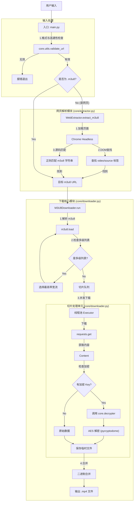
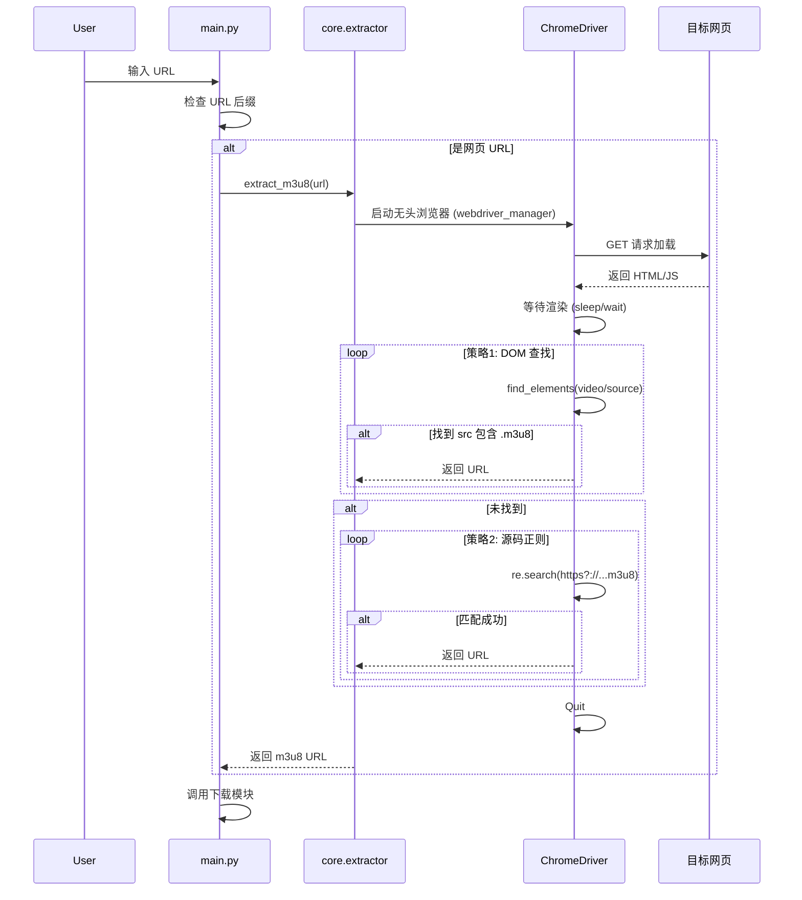

# 智能 m3u8 视频下载器技术文档

## 1. 项目简介

本项目实现了一个智能化的视频下载工具，旨在解决复杂场景下的 HLS (m3u8) 视频下载问题。它不仅支持直接的 m3u8 链接下载，还能自动解析网页中的视频地址，并具备处理加密流、伪装后缀、多级播放列表等高级功能。

项目已采用模块化设计，结构清晰，易于扩展和维护。

## 2. 核心功能

1.  **智能输入识别与检测**:
    - 自动区分用户输入的是 m3u8 地址还是网页地址。
    - **预检测机制**: 在启动任务前自动验证 URL 的格式和连通性，尽早拦截无效输入。
2.  **网页自动解析**: 使用 Selenium 模拟浏览器环境，通过 DOM 遍历和正则匹配双重策略提取 m3u8 地址。
3.  **复杂流处理**:
    - 支持 AES-128 加密流的自动解密。
    - 支持非标准后缀（如 .jpg, .png）的切片下载。
    - 支持多级 m3u8 播放列表（自动选择最高画质）。
4.  **稳健下载**:
    - 多线程并发下载切片。
    - 自动重试与错误处理。
    - 内存中解密，无中间明文落地。
    - 二进制直接合并，避免编码兼容性问题。

## 3. 项目结构

```
downloader-py/
├── main.py                # 统一入口文件
├── core/                  # 核心逻辑包
│   ├── downloader.py      # m3u8 下载与合并逻辑 (M3U8Downloader 类)
│   ├── extractor.py       # 网页解析逻辑 (WebExtractor 类)
│   ├── decrypter.py       # 解密逻辑 (Decrypter 类)
│   └── utils.py           # 通用工具 (路径处理、文件清理)
├── specs/                 # 需求与设计文档
└── README.md              # 项目文档
```

## 4. 架构设计

### 4.1 模块交互图



### 4.2 详细处理流程

#### A. 网页解析流程



## 5. 关键技术点

1.  **WebDriver 自动管理**: 使用 `webdriver_manager` 库，在运行时动态下载与本地 Chrome 版本匹配的 ChromeDriver，彻底解决了版本不一致导致的 `SessionNotCreatedException` 错误。
2.  **鲁棒的 URL 拼接**: 使用 `urllib.parse.urljoin` 处理 m3u8 中的相对路径，确保无论是 `/` 开头的绝对路径还是相对当前目录的路径都能正确转换。
3.  **对抗混淆**:
    - 不依赖文件后缀判断文件类型，直接处理二进制流，有效应对将 `.ts` 伪装成 `.jpg` 的反爬策略。
    - 模拟真实浏览器 User-Agent，防止服务器拒绝请求。
4.  **内存解密**: 即使视频流被加密，解密过程也在内存中完成，写入磁盘的直接是解密后的视频数据，方便后续合并和播放。

## 6. 依赖库

- `selenium`: 网页自动化
- `webdriver-manager`: 驱动管理
- `m3u8`: 播放列表解析
- `requests`: HTTP 请求
- `pycryptodome`: AES 解密

## 7. 快速开始

### 环境准备

1.  **Python 版本**: 确保已安装 Python 3.8+。
2.  **Chrome 浏览器**: 确保系统已安装 Google Chrome 浏览器（Selenium 解析需要）。
3.  **安装依赖**:
    ```bash
    pip install -r requirements.txt
    ```

### 启动项目

支持两种输入模式，并可使用 `-o` 或 `--output` 指定下载目录：

1.  **直接下载 m3u8**:
    ```bash
    python3 main.py "https://example.com/video/index.m3u8"
    ```

2.  **网页自动解析**:
    ```bash
    python3 main.py "https://example.com/page-with-video.html"
    ```

3.  **指定输出目录**:
    ```bash
    python3 main.py "https://example.com/video.m3u8" -o /Users/username/Movies/my_videos
    ```

默认下载目录为 `~/Downloads/tx/`。
