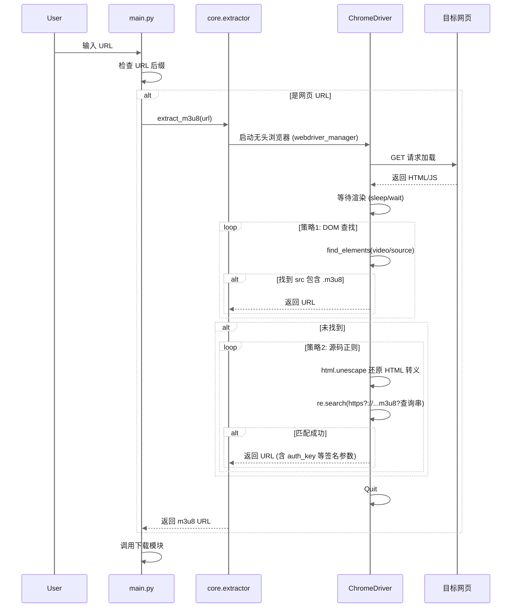
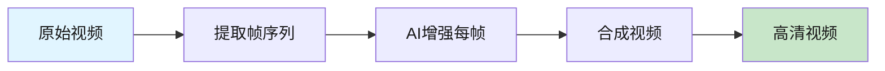

# 智能 m3u8 视频下载器技术文档

## 1. 项目简介

本项目实现了一个智能化的视频下载工具，旨在解决复杂场景下的 HLS (m3u8) 视频下载问题。它不仅支持直接的 m3u8 链接下载，还能自动解析网页中的视频地址，并具备处理加密流、伪装后缀、多级播放列表、fMP4 初始化段、TS 流重封装等高级功能。

项目采用模块化设计，支持 CLI（命令行）和 GUI（图形界面）双模式运行。下载核心功能跨 macOS、Linux 及 Windows 平台；AI 视频增强功能目前仅提供 Mac 可执行文件，仅支持 macOS。

## 2. 核心功能

1.  **智能输入识别与检测**:
    - 自动区分用户输入的是 m3u8 地址还是网页地址。
    - **预检测机制**: 在启动任务前自动验证 URL 的格式和连通性（SSL 错误、连接超时时放行，交由后续流程继续尝试；403 反爬场景对网页地址放行）。
2.  **网页自动解析**:
    - 使用 Selenium 模拟浏览器环境。
    - **智能标题提取**: 自动提取网页标题或 H1 标签作为视频文件名。
    - **深度 URL 清洗**: 自动处理嵌套在播放器参数中的真实 m3u8 地址。
    - **签名 URL 完整提取**: 保留 m3u8 地址中的 `auth_key` 等时效性签名参数，并自动还原页面中的 HTML 转义实体（`&amp;`、`&quot;` 等），避免签名被截断导致 400 错误。
3.  **复杂流处理**:
    - 支持 AES-128 加密流的自动解密（解密后的切片临时存放于本地，任务结束后自动清理）。
    - 支持非标准后缀（如 .jpg, .png）的切片下载。
    - 支持多级 m3u8 播放列表（自动选择最高画质）。
    - 支持 fMP4 格式 HLS 流（`EXT-X-MAP`）：自动下载初始化段并置于合并文件头部。
4.  **稳健下载**:
    - 多线程并发下载切片。
    - 自动重试与错误处理（基于 tenacity 指数退避）。
    - **智能命名**: 优先使用网页标题，无标题时自动使用时间戳+序号生成唯一文件名，防止覆盖。
    - **TS 流自动重封装**: 检测到 MPEG-TS 合并结果时，自动调用 ffmpeg 无损重封装（`-c copy`）为标准 MP4，确保 Preview/QuickTime 等原生播放器可播放；未安装 ffmpeg 时保留原始拼接结果并给出提示。
5.  **双模式运行**:
    - **CLI**: 纯命令行模式，适合脚本调用。
    - **GUI**: 基于 Streamlit 的图形界面，操作更直观。
6.  **AI 视频增强**:
    - 使用 Real-ESRGAN 进行超分辨率处理。
    - 通过 Vulkan 接口支持 GPU 加速（仅 macOS）。
    - 提供 2x、3x、4x 放大倍数。
    - 支持通用视频和动画专用模型。

## 3. 项目结构

```text
smart-downloader/
├── main.py                # CLI 统一入口文件
├── streamlit_app.py       # GUI 入口文件
├── enhance_video.py       # AI 视频增强工具
├── mac_app/               # Mac 桌面 App (pywebview 内嵌浏览器)
│   ├── main.py            # App 入口 (创建窗口、注入嗅探脚本)
│   ├── api.py             # JS <-> Python 桥接层 (导航/下载/进度)
│   ├── index.html         # App 首页 (地址输入与使用引导)
│   ├── sniffer.js         # 注入页面的 m3u8 嗅探脚本 + 悬浮下载工具栏
│   ├── setup.py           # py2app 打包配置
│   ├── build_app.sh       # 一键构建脚本 (py2app + 动态库补齐)
│   └── requirements.txt   # App 依赖
├── core/                  # 核心逻辑包
│   ├── downloader.py      # m3u8 下载与合并逻辑 (M3U8Downloader 类)
│   ├── extractor.py       # 网页解析逻辑 (WebExtractor 类)
│   ├── decrypter.py       # 解密逻辑 (Decrypter 类)
│   └── utils.py           # 通用工具 (路径处理、文件清理)
├── tools/                 # 工具目录
│   └── realesrgan/        # Real-ESRGAN 增强工具
│       ├── realesrgan-ncnn-vulkan  # Mac 可执行文件
│       └── models/        # 预训练模型
├── specs/                 # 需求与设计文档
│   ├── m3u8_downloader/   # 下载核心模块设计文档
│   └── web_m3u8_downloader/# 网页解析模块设计文档
└── README.md              # 项目文档
```

## 4. 架构设计

### 4.1 模块交互图


```mermaid
%%{init: {"theme": "default", "themeVariables": {"textColor": "#1a1a1a", "primaryTextColor": "#1a1a1a", "edgeLabelTextColor": "#1a1a1a", "edgeLabelBackground": "#ffffff"}}}%%
graph TD
    User["用户输入"] --> Entry["入口: main.py / streamlit_app.py"]

    subgraph InputProcess["输入处理"]
        Entry -->|"1.格式与连通性检查"| Validator["core.utils.validate_url"]
        Validator -->|"无效"| Exit["报错/提示"]
        Validator -->|"有效"| Check{"是否为 .m3u8?"}
    end

    subgraph WebParse["网页解析模块 core/extractor.py"]
        Check -->|"No 是网页"| WebParser["WebExtractor.extract_m3u8"]
        WebParser -->|"1.加载页面"| Driver["Chrome Headless"]
        Driver -->|"2.DOM查找"| FindDOM["查找 video/source 标签"]
        Driver -->|"3.源码匹配"| FindRegex["正则匹配 m3u8 字符串"]
        FindDOM -->|"找到"| ResultURL
        FindRegex -->|"找到"| ResultURL
    end

    Check -->|"Yes"| ResultURL["目标 m3u8 URL"]

    subgraph DownloadCore["下载核心模块 core/downloader.py"]
        ResultURL --> Downloader["M3U8Downloader.run"]
        Downloader -->|"1.解析 m3u8"| PlaylistParser["m3u8.load"]
        PlaylistParser -->|"2.检查多级列表"| VariantCheck{"是多级列表?"}
        VariantCheck -->|"Yes"| SelectBest["选择最高带宽流"]
        SelectBest --> PlaylistParser
        VariantCheck -->|"No"| MapCheck{"有 EXT-X-MAP?"}

        MapCheck -->|"Yes fMP4流"| InitSection["下载初始化段"]
        MapCheck -->|"No"| SegmentQueue["切片队列"]
        InitSection --> SegmentQueue

        SegmentQueue -->|"3.并发下载"| Workers["线程池 Executor"]

        subgraph SegmentUnit["切片处理单元 core/downloader.py"]
            Workers -->|"下载"| Request["requests.get"]
            Request -->|"获取内容"| Content
            Content -->|"检查加密"| KeyCheck{"有加密 Key?"}
            KeyCheck -->|"Yes"| DecryptWrapper["调用 core.decrypter"]
            DecryptWrapper --> DecryptAlgo["AES 解密"]
            KeyCheck -->|"No"| Raw["原始数据"]
            DecryptAlgo --> SaveTemp["保存临时文件"]
            Raw --> SaveTemp
        end

        SaveTemp -->|"4.合并 init段置首"| Merger["二进制合并"]
        Merger --> TsCheck{"是 MPEG-TS 流?"}
        TsCheck -->|"Yes"| Remux["ffmpeg 无损重封装"]
        TsCheck -->|"No"| Output["输出 .mp4 文件"]
        Remux --> Output
    end

    style InputProcess fill:#eef4ff,stroke:#3b5bdb,color:#1a1a1a
    style WebParse fill:#eefaf0,stroke:#2f9e44,color:#1a1a1a
    style DownloadCore fill:#fff5ee,stroke:#e8590c,color:#1a1a1a
    style SegmentUnit fill:#f7f7f7,stroke:#888888,color:#1a1a1a
```

### 4.2 详细处理流程

#### A. 网页解析流程


```mermaid
%%{init: {"theme": "default", "themeVariables": {"textColor": "#1a1a1a", "primaryTextColor": "#1a1a1a", "actorTextColor": "#1a1a1a", "actorLineColor": "#666666", "signalColor": "#666666", "signalTextColor": "#1a1a1a", "labelBoxBkgColor": "#ffffff", "labelBoxBorderColor": "#cccccc"}}}%%
sequenceDiagram
    participant User
    participant Main as main.py
    participant Extractor as core.extractor
    participant Chrome as ChromeDriver
    participant Page as 目标网页

    User->>Main: 输入 URL
    Main->>Main: 检查 URL 后缀
    alt 是网页 URL
        Main->>Extractor: extract_m3u8(url)
        Extractor->>Chrome: 启动无头浏览器 (webdriver_manager)
        Chrome->>Page: GET 请求加载
        Page-->>Chrome: 返回 HTML/JS
        Chrome->>Chrome: 等待渲染 (sleep/wait)

        loop 策略1: DOM 查找
            Chrome->>Chrome: find_elements(video/source)
            alt 找到 src 包含 .m3u8
                Chrome-->>Extractor: 返回 URL
            end
        end

        alt 未找到
            loop 策略2: 源码正则
                Chrome->>Chrome: html.unescape 还原 HTML 转义
                Chrome->>Chrome: re.search(https?://...m3u8?查询串)
                alt 匹配成功
                    Chrome-->>Extractor: 返回 URL (含 auth_key 等签名参数)
                end
            end
        end
        Chrome->>Chrome: Quit
        Extractor-->>Main: 返回 m3u8 URL
    end
    Main->>Main: 调用下载模块
```

## 5. 关键技术点

1.  **WebDriver 自动管理**: 使用 `webdriver_manager` 库，在运行时动态下载与本地 Chrome 版本匹配的 ChromeDriver，彻底解决了版本不一致导致的 `SessionNotCreatedException` 错误。
2.  **鲁棒的 URL 拼接**: 使用 `urllib.parse.urljoin` 处理 m3u8 中的相对路径，确保无论是 `/` 开头的绝对路径还是相对当前目录的路径都能正确转换。
3.  **签名 URL 提取**: 页面中的 m3u8 地址常带 `auth_key` 等时效性签名参数，且在 HTML 中经过实体转义。提取时先做 HTML 反转义（`html.unescape`），再用正则完整保留查询串，避免签名被截断导致 400 Bad Request。
4.  **fMP4 初始化段处理**: 对含 `EXT-X-MAP` 的 fMP4 格式 HLS 流，自动下载初始化段（含 `moov` box 的轨道信息）并置于合并文件头部；缺失该段会导致文件无法解码播放。
5.  **TS 流检测与重封装**: 合并完成后通过文件头同步字节（`0x47`）识别 MPEG-TS 流，调用 ffmpeg 无损重封装（`-c copy`，不重新编码）为标准 MP4 容器，解决 Preview/QuickTime 不支持裸 TS 流的问题。
6.  **对抗混淆**:
    - 不依赖文件后缀判断文件类型，直接处理二进制流，有效应对将 `.ts` 伪装成 `.jpg` 的反爬策略。
    - 模拟真实浏览器 User-Agent，防止服务器拒绝请求。
7.  **切片级解密**: 加密切片下载后逐个解密再写入临时文件，任务结束自动清理临时目录。

### 5.1 已知限制

- **AES-128 IV 缺省场景**: 播放列表未声明 IV 时，当前以全 0 兜底解密；部分视频源要求从切片序列号（media sequence）推导 IV，此类流会解密失败。
- **ffmpeg 缺失时的降级**: 未安装 ffmpeg 时，TS 格式源输出的文件为裸 TS 流拼接结果，需要 VLC/IINA 等基于 ffmpeg 的播放器才能播放。
- **签名 URL 时效性**: 从网页提取的 `auth_key` 签名有时效限制，提取后应尽快开始下载；过期后需重新运行以获取新签名。

## 6. 环境与依赖

### 6.1 运行环境

- **Operating System**: 下载核心功能支持 macOS / Linux / Windows；AI 视频增强目前仅提供 Mac 可执行文件 (realesrgan-ncnn-vulkan)，仅支持 macOS
- **Python**: 3.8+
- **Browser**: Google Chrome (用于 Selenium 网页解析)
- **ffmpeg** (可选，推荐安装): 用于将 TS 格式源的合并结果无损重封装为标准 MP4；未安装时保留 TS 流拼接结果并提示。AI 视频增强功能则必需 ffmpeg

### 6.2 Python 依赖

- `selenium`: 网页自动化
- `webdriver-manager`: 驱动管理
- `m3u8`: 播放列表解析
- `requests`: HTTP 请求
- `pycryptodome`: AES 解密
- `tenacity`: 切片下载自动重试（指数退避）
- `streamlit`: Web GUI 界面

安装命令:

```bash
pip install -r requirements.txt
```

## 7. 部署与运行

### 7.1 本地运行

#### 方式一：Web 图形界面 (Streamlit)

无需记忆复杂命令，直接在浏览器中操作。

```bash
streamlit run streamlit_app.py
```

- **特点**:
  - 支持实时进度条显示。
  - 自动识别网页标题。
  - 友好的错误提示与排查建议。
  - 自动识别用户主目录，安全保存文件。

#### 方式二：Mac 桌面 App（内嵌浏览器，一键下载）- **推荐**

App 内置浏览器，直接访问视频网页，自动嗅探 m3u8 后点击悬浮工具栏的「下载视频」即可，无需复制链接。

```bash
# 安装依赖
pip install -r mac_app/requirements.txt

# 开发模式运行
python3 mac_app/main.py
```

打包为独立 .app（可双击分发，无需安装 Python）：

```bash
cd mac_app && ./build_app.sh
# 产物: mac_app/dist/Smart Downloader.app
```

> 说明: 构建脚本在 py2app 之后会自动补齐 conda 环境的动态库（libssl/libffi 等），py2app 不会自动打包它们。

- **工作原理**:
  - pywebview (WKWebView) 内嵌浏览器，用户在 App 内正常访问视频网页
  - 每个页面自动注入嗅探脚本：Hook XHR/fetch 捕获播放器请求的 m3u8（含签名参数）、扫描 video/source 标签
  - 嗅探到视频后，悬浮工具栏的下载按钮激活，点击调用 Python 侧 M3U8Downloader 下载
  - 复用下载核心的全部能力（AES-128 解密、多级列表、fMP4、TS 重封装）

#### 方式三：命令行 (CLI)

适合脚本集成或习惯命令行的用户。

1.  **直接下载 m3u8**:

    ```bash
    python3 main.py "https://example.com/video/index.m3u8"
    ```

2.  **网页自动解析**:

    ```bash
    python3 main.py "https://example.com/page-with-video.html"
    ```

3.  **指定输出目录**:
    ```bash
    # 默认下载目录为 ~/Downloads/tx/
    # 可以使用 -o 参数指定其他目录 (必须在用户主目录下)
    python3 main.py "https://example.com/video.m3u8" -o ~/Movies/my_videos
    ```

### 7.2 服务器部署 (Ubuntu 24)

若需在 Ubuntu 24 服务器上运行（无头模式），需要先安装 Chrome 浏览器：

```bash
# 1. 安装 Chrome
wget https://dl.google.com/linux/direct/google-chrome-stable_current_amd64.deb
sudo apt install ./google-chrome-stable_current_amd64.deb

# 2. 安装 Python 依赖
pip install -r requirements.txt

# 3. 运行 (CLI 模式)
python3 main.py "YOUR_URL"
```

注意：服务器环境通常没有图形界面，建议使用 CLI 模式。如果需要使用 Streamlit GUI，需要配置防火墙开放 8501 端口。

## 8. 项目测试

目前项目主要依赖手动测试。

1.  **单元测试**: 暂无。
2.  **功能验证**:
    - **测试直接 m3u8 下载**: 找一个公开的 m3u8 链接 (如 Apple HLS 示例流) 运行 `main.py`。
    - **测试网页解析**: 找一个包含 video 标签的网页运行 `main.py`。
    - **测试 GUI**: 运行 `streamlit_app.py` 并进行交互操作。

## 9. AI 视频增强功能

### 9.1 功能简介

使用 Real-ESRGAN 深度学习模型对下载的视频进行超分辨率处理，提升视频清晰度。支持 Mac M3 Pro GPU 加速，处理速度比传统 CPU 快 5-10 倍。

### 9.2 技术原理


```mermaid
%%{init: {"theme": "default", "themeVariables": {"textColor": "#1a1a1a", "primaryTextColor": "#1a1a1a", "edgeLabelTextColor": "#1a1a1a", "edgeLabelBackground": "#ffffff"}}}%%
graph LR
    A[原始视频] --> B[提取帧序列]
    B --> C[AI增强每帧]
    C --> D[合成视频]
    D --> E[高清视频]

    style A fill:#e1f5ff,color:#1a1a1a
    style E fill:#c8e6c9,color:#1a1a1a
```

**核心流程**:

1. 使用 ffmpeg 提取视频帧
2. 使用 Real-ESRGAN 对每帧进行超分辨率重建
3. 重新合成视频并保留原始音频

### 9.3 安装依赖

```bash
# 1. 安装 ffmpeg (必需)
brew install ffmpeg

# 2. Real-ESRGAN 已包含在 tools/realesrgan/ 目录中
# 无需额外安装
```

### 9.4 使用方法

#### 基础用法

```bash
# 增强单个视频（默认 2 倍放大）
python3 enhance_video.py your_video.mp4

# 指定输出路径
python3 enhance_video.py your_video.mp4 -o enhanced_video.mp4

# 3 倍放大
python3 enhance_video.py your_video.mp4 -s 3

# 4 倍放大
python3 enhance_video.py your_video.mp4 -s 4
```

#### 选择模型

```bash
# 通用模型（推荐，适合真人视频）
python3 enhance_video.py video.mp4 -m realesrgan-x4plus

# 动画专用（适合动漫）
python3 enhance_video.py anime.mp4 -m realesrgan-x4plus-anime

# 动画视频专用（速度快，适合长视频）
python3 enhance_video.py anime.mp4 -m realesr-animevideov3
```

#### 批量处理

```bash
# 批量处理目录中的所有视频
python3 enhance_video.py ~/Downloads/tx/ -b

# 指定输出目录
python3 enhance_video.py ~/Downloads/tx/ -o ~/Downloads/enhanced/ -b
```

### 9.5 模型对比

| 模型名称                | 适用场景       | 速度 | 效果 | 推荐指数   |
| ----------------------- | -------------- | ---- | ---- | ---------- |
| realesrgan-x4plus       | 真人视频、通用 | 中等 | 最佳 | ⭐⭐⭐⭐⭐ |
| realesrgan-x4plus-anime | 动漫、动画     | 中等 | 最佳 | ⭐⭐⭐⭐⭐ |
| realesr-animevideov3    | 动画视频       | 快   | 良好 | ⭐⭐⭐⭐   |

### 9.6 性能参考

**测试环境**: MacBook Pro M3 Pro (18GB 内存)。以下为该单一机型的实测参考值，不同硬件配置与视频内容下偏差较大，仅供参考。

| 视频时长 | 分辨率 | 放大倍数 | 预计耗时      |
| -------- | ------ | -------- | ------------- |
| 1 分钟   | 720p   | 2x       | 约 8-12 分钟  |
| 5 分钟   | 1080p  | 2x       | 约 30-40 分钟 |
| 10 分钟  | 480p   | 4x       | 约 50-60 分钟 |

### 9.7 完整工作流示例

```bash
# 1. 下载视频
python3 main.py "https://example.com/video.html"

# 2. 增强视频（2倍放大，通用模型）
python3 enhance_video.py ~/Downloads/tx/video.mp4 -s 2 -m realesrgan-x4plus

# 3. 查看结果
# 增强后的视频保存在: ~/Downloads/tx/video_2x_enhanced.mp4
```

### 9.8 注意事项

1. **磁盘空间**: 增强过程会生成临时文件，确保有足够的磁盘空间（至少为原视频的 3-5 倍）
2. **处理时间**: 视频增强是计算密集型任务，长视频可能需要数小时
3. **效果限制**: AI 无法无中生有，如果原视频质量极差，增强效果有限
4. **音频保留**: 增强过程会保留原始音频轨道
