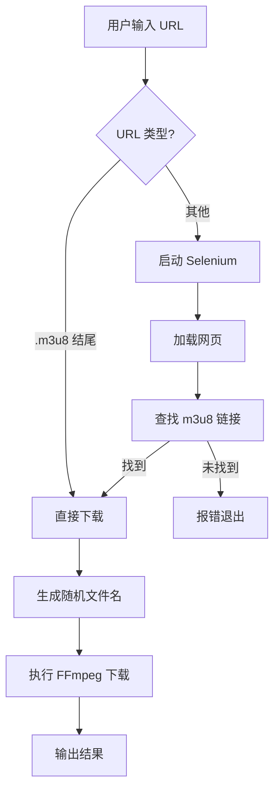

# 技术方案设计

## 介绍

本方案旨在设计一个集成了网页解析和视频下载功能的 Python 脚本。它将利用 Selenium 模拟浏览器行为来处理动态网页，提取 m3u8 地址，并使用 ffmpeg 高效下载视频。

## 架构设计

### 模块划分

1.  **输入处理模块**: 识别输入 URL 类型（直接 m3u8 或 网页 URL）。
2.  **网页解析模块 (Selenium)**:
    -   初始化 Chrome Driver（无头模式）。
    -   加载页面并等待渲染。
    -   通过 XPath 或 Regex 查找 `.m3u8` 资源链接。
3.  **下载执行模块 (FFmpeg)**:
    -   复用 `download_random_m3u8.py` 的核心逻辑。
    -   处理文件名生成、目录管理。
    -   执行下载命令。

### 技术选型

-   **Selenium**: 用于处理 JavaScript 动态加载的网页，获取最终渲染后的 DOM。
-   **Chromedriver**: Chrome 浏览器的驱动程序，需确保路径正确（根据现有 `download_m3u8.py`，路径可能在 `/usr/local/bin/chromedriver`，需做兼容性检查或自动查找）。
-   **FFmpeg**: 视频流下载与合并。

### 流程图



## 详细设计

### 代码结构

我们将创建一个新脚本 `smart_downloader.py`，整合解析与下载功能。

```python
import argparse
import re
import subprocess
import uuid
import time
from pathlib import Path
from selenium import webdriver
from selenium.webdriver.chrome.options import Options
from selenium.webdriver.chrome.service import Service
from selenium.webdriver.common.by import By

def get_m3u8_from_url(url):
    # 配置 Selenium
    options = Options()
    options.add_argument("--headless")
    # ... 其他配置
    
    driver = webdriver.Chrome(options=options)
    driver.get(url)
    time.sleep(5) # 等待加载
    
    # 查找逻辑
    # 1. 查找 video 标签 src
    # 2. 查找 <a> 标签 href
    # 3. 页面源码正则匹配
    
    driver.quit()
    return m3u8_url

def download_video(m3u8_url):
    # 复用之前的下载逻辑
    pass

def main():
    # 参数解析与流程控制
    pass
```

### 关键点

1.  **Selenium 等待策略**: 简单的 `time.sleep` 可能不够稳健，可以结合 `WebDriverWait`，但考虑到简单性，先用 sleep 配合隐式等待。
2.  **m3u8 提取策略**:
    -   优先检查 `video` 标签。
    -   其次检查页面源码中的字符串匹配（因为有些播放器通过 JS 加载 m3u8，不直接在 DOM 的 href 中）。
    -   根据用户提供的示例 `https://thm3u8.com/...`，这是一个常见的切片服务器，通常 URL 会在源码中暴露。

## 安全性与依赖

-   脚本依赖 `selenium` 库和 `ffmpeg`。
-   需要用户系统中有 Chrome 浏览器和对应的 ChromeDriver。

## 测试策略

1.  **直接 URL 测试**: 输入一个 `.m3u8` 地址，确认直接下载。
2.  **网页 URL 测试**: 输入用户提供的网页 URL，确认能解析并下载。
